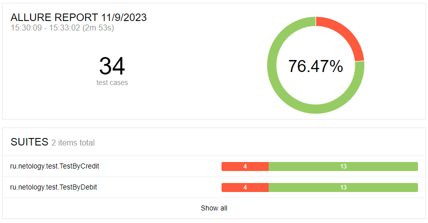
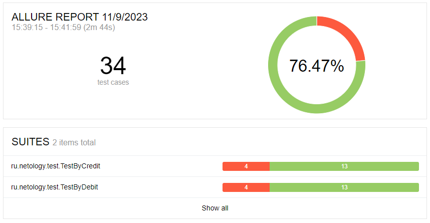

## Отчёт по итогам автоматизированного тестирования

### Краткое описание

В соответствии с [планом](https://github.com/MVGIC/QA-Diploma/blob/master/Documentation/Plan.md) было проведено автоматизированное тестирование веб-сервиса покупки туров.

- В ходе автоматизации тестирования были реализованы позитивные и негативные сценарии;
- Реализована поддержка двух баз данных - MySQL и PostgreSQL;
- Протестирована возможность сохранения информации о платеже и успешности его проведения в БД.

### Тест-кейсы

Общее количество тест-кейсов - 34:

- Оплата по дебетовой карте - 17 (позитивных - 2, негативных - 15)
- Оплата по кредитной карте - 17 (позитивных - 2, негативных - 15)

### Результаты выполнения автотестов:

#### При подключении к СУБД MySQL

* 26 - успешных, что составляет 76.47%
*  8  - не прошло, что составляет 23.52%

#### При подключении к СУБД PostgreSQL

* 26 - успешных, что составляет 76.47%
*  8 - не прошло, что составляет 23.52%

### Общие рекомендации

#### По результатам тестирования необходимо:

- Исправить найденные баги описанные в [issues](https://github.com/EvheniiV/diplom_QA/issues)

- Создать документацию с подробным описанием функциональности приложения и инструкциями по тестированию, 
сделать тестовые метки.

- Необходимо улучшить обработку ошибок и предоставление пользователю информативных сообщений о возникающих 
проблемах. Это поможет повысить удовлетворенность пользователей приложением.